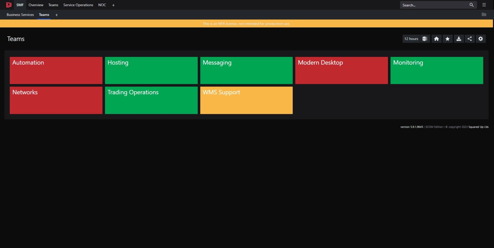

One of the benefits of using a standard set of objects for monitoring is that it's straightforward to create dashboards and perspectives for SquaredUp. The perspectives targeted at Teams and Business Services effectively become standard dashboards that are available for all Teams and Business Services. Meaning changes made to the perspectives take effect for all Teams and Business Services. No need to try and maintain consistent dashboards and less JSON to maintain! 

# Dashboards

## Business Services

Shows the health state of all SMF Business Services.

[Dashboard JSON](<Dashboards/JSON/Business Services.json>)

## Teams

Shows the health state of all SMF Teams. Team health rolls up from Business Services.

[Dashboard JSON](Dashboards/JSON/Teams.json)

# Perspectives

## SMF Monitored Object

Perspective for all SMF monitoring objects. Displays:

* Properties used to control monitoring
* Monitors that are enabled for the object
* Team that own the object
* Related Business Services
* Performance metrics for the object

[Perspective JSON](<Perspectives/JSON/SMF Monitored Object.json>)

## Business Service 

Perspective for all SMF Business Services. Displays:

* Team that own the object
* Properties of the Business Service
* Health state of contained components
* Alert heatmap
* Open Alerts  

[Perspective JSON](<Perspectives/JSON/Business Service.json>)

## Team

Perspective for all SMF Teams. Displays:

* Health state of all Business Services owned by the team
* Open Alerts

[Perspective JSON](Perspectives/JSON/Team.json)

## Business Service Component

Perspective for all SMF Business Service Components. Displays:

* Properties of component
* Alert heatmap
* Parent Business Service
* Child components
* Open Alerts

[Perspective JSON](<Perspectives/JSON/Business Service Component.json>)

## Business Service Component - Linux Process

Perspective for all SMF Business Service Components that contain Linux Processes. Displays:

* State of Linux Processes
* Performance tiles for
  * Instance Count
  * Used Memory KBytes
  * % Processor Time

[Perspective JSON](<Perspectives/JSON/Business Service Component - Linux Process.json>)

## Business Service Component - Linux Command

Perspective for all SMF Business Service Components that contain Linux Commands. Displays:

* State of Linux Commands
* Performance tile for Command StdOut

[Perspective JSON](<Perspectives/JSON/Business Service Component - Linux Command.json>)

## Business Service Component - Windows Command

Perspective for all SMF Business Service Components that contain Windows Commands. Displays:

* State of Windows Commands
* Performance tile for Command StdOut

[Perspective JSON](<Perspectives/JSON/Business Service Component - Windows Command.json>)

## Business Service Component - Windows Ping

Perspective for all SMF Business Service Components that contain Windows Pings. Displays:

* State of Windows Pings
* Performance tile for Ping response time

[Perspective JSON](<Perspectives/JSON/Business Service Component - Windows Ping.json>)

## Business Service Component - Windows Port

Perspective for all SMF Business Service Components that contain Windows Ports. Displays:

* State of Windows Ports
* Performance tile for Port connection time

[Perspective JSON](<Perspectives/JSON/Business Service Component - Windows Port.json>)

## Business Service Component - OLEDB

Perspective for all SMF Business Service Components that contain OLEDB. Displays:

* State of OLEDBs
* Performance tiles for
  * Connection and Query Execution Time
  * Query Result

[Perspective JSON](<Perspectives/JSON/Business Service Component - OLEDB.json>)

## Business Service Component - URL

Perspective for all SMF Business Service Components that contain URL. Displays:

* State of URLs
* Performance tiles for
  * DNS Resolution Time
  * Download Time
  * Response Time

[Perspective JSON](<Perspectives/JSON/Business Service Component - URL.json>)