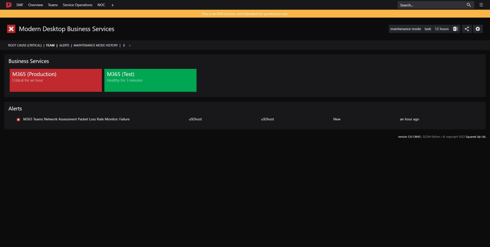

One of the benefits of using a standard set of objects for monitoring is that it's straightforward to create dashboards and perspectives for SquaredUp. The perspectives targeted at Teams and Business Services effectively become standard dashboards that are available for all Teams and Business Services. Meaning changes made to the perspectives take effect for all Teams and Business Services. No need to try and maintain consistent dashboards and less JSON to maintain! 

> I'm still creating perspectives for the various monitoring types. They will appear here soon. 

# Dashboards

## Business Services

Shows the health state of all SMF Business Services.

[Dashboard JSON](<Dashboards/JSON/Business Services.json>)

## Teams

Shows the health state of all SMF Teams. Team health rolls up from Business Services.

[Dashboard JSON](Dashboards/JSON/Teams.json)

# Perspectives

## SMF Monitored Object

Perspective for all SMF monitoring objects. Displays:

* Properties used to control monitoring
* Monitors that are enabled for the object
* Team that own the object
* Related Business Services
* Performance metrics for the object

[Perspective JSON](<Perspectives/JSON/SMF Monitored Object.json>)

## Business Service 

Perspective for all SMF Business Services. Displays:

* Team that own the object
* Properties of the Business Service
* Health state of contained components
* Alert heatmap
* Open Alerts  

[Perspective JSON](<Perspectives/JSON/Business Service.json>)

## Team

Perspective for all SMF Teams. Displays:

* Health state of all Business Services owned by the team
* Open Alerts

[Perspective JSON](Perspectives/JSON/Team.json)